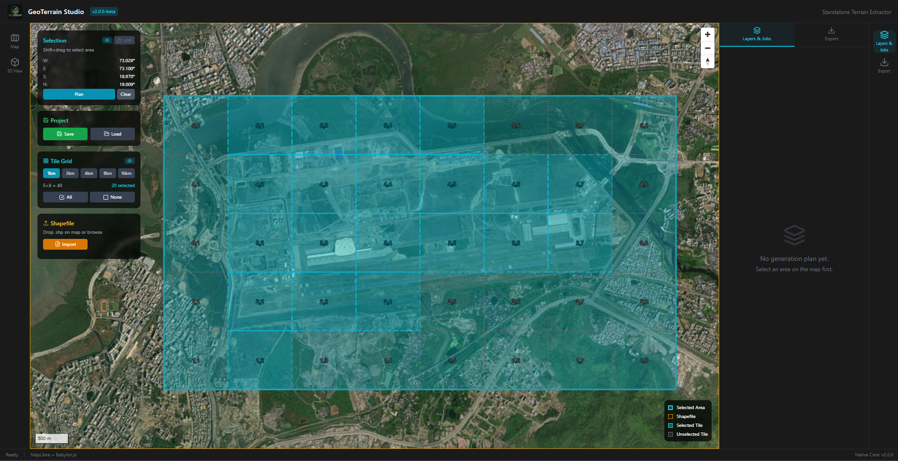

<div align="center">

# GeoTerrain Studio

**Real-world terrain extraction and engine-ready export for games, simulation, and geospatial visualization.**

<em>Select an area on a live map, download elevation and satellite imagery, generate tiled terrain packages, and preview them instantly in Babylon.js or import them into Blender.</em>

<br />


<br />



</div>

---

GeoTerrain Studio is a desktop geospatial terrain tool that turns a selected map region into a self-contained terrain package. It downloads DEM height data, pulls satellite imagery, crops and resamples the results, writes engine-friendly heightmap/albedo files, and stores all metadata in a manifest that downstream tools can read.

The project currently focuses on a fast terrain creation workflow: map selection, tiled export, Babylon.js preview, and Blender import. The optional native addon is present but still stubbed, so exports are intentionally handled by the Node/Electron export engine.

## Key Features

- **Interactive Area Selection:** Draw a bounding box on a MapLibre map and split it into selectable terrain tiles.
- **DEM + Imagery Export:** Generate heightmaps and albedo textures from public terrain and satellite sources.
- **Engine Presets:** Export for Babylon.js, Blender, UNIGINE-style workflows, Unreal-style RAW heightmaps, and generic GIS pipelines.
- **Built-In 3D Preview:** Load Babylon.js terrain directly from the exported package for quick visual validation.
- **Multi-Tile Packages:** Export selected tiles into `tile_<row>_<col>` folders with a combined root `manifest.json`.
- **Blender Bridge Add-On:** Import GeoTerrain packages into Blender as displaced terrain planes with albedo materials.
- **Manifest-Driven Pipeline:** Every asset is described by a clear JSON contract for tools, agents, and future engine bridges.

## Core Technologies

| Layer | Stack |
| --- | --- |
| Desktop Shell | Electron |
| UI | React, TypeScript, Tailwind CSS |
| 2D Map | MapLibre GL |
| 3D Preview | Babylon.js |
| Raster Processing | Sharp, GeoTIFF parser/writer |
| State | Zustand |
| Native Addon | Node-API C++ stubs |
| Blender Import | Python add-on |

## Repository Structure

```text
GeoTerrain/
  GeoTerrainStudio/
    electron/
      main.ts                 # Electron main process and IPC handlers
      preload.ts              # Secure renderer bridge
      export-engine.ts        # DEM/imagery download and package export
      geotiff-writer.ts       # Minimal GeoTIFF writer
      native/                 # Node-API native addon stubs
    src/
      components/
        MapViewport/          # Map selection and tile grid
        ExportPanel/          # Export presets and package writer UI
        Viewer3D/             # Babylon.js terrain preview
        LayerStack/
        JobQueue/
        Toast/
      core/
        ipc.ts                # Typed IPC wrapper
        store.ts              # Zustand state
      types/
        terrain.ts            # Manifest and app domain types
  EnginesAddOn/
    GeoTerrainBlender/        # Blender import add-on source
  images/
    image.png                 # GitHub README hero image
  AGENTS.md                   # Detailed guide for AI coding agents
```

## Terrain Package Format

Each export creates a folder with one root manifest and one folder per selected tile.

```text
ExportFolder/
  manifest.json
  tile_0_1/
    manifest.json
    tile_0_1_heightmap.png
    tile_0_1_albedo.png
  tile_1_2/
    manifest.json
    tile_1_2_heightmap.png
    tile_1_2_albedo.png
```

The manifest includes bounds, CRS, tile grid metadata, file paths, elevation range, data sources, and export preset. See [`GeoTerrainStudio/src/types/terrain.ts`](GeoTerrainStudio/src/types/terrain.ts) for the TypeScript contract.

## Quick Start

```bash
cd GeoTerrainStudio
npm install
npm run dev:electron
```

For a production-style validation build:

```bash
cd GeoTerrainStudio
npm run build:vite
npm run build:electron
```

## Export Workflow

1. Open **Map** and select an area.
2. Choose tile size and selected tiles.
3. Open **Export** and choose a target preset.
4. For Babylon.js preview, use PNG heightmap and PNG albedo.
5. Export the terrain package.
6. Open **3D View** to inspect the generated terrain.
7. Use the Blender add-on to import the same package into Blender.

## Data Sources

Default keyless sources:

- **DEM:** AWS Terrarium / Mapzen elevation tiles
- **Imagery:** ArcGIS World Imagery

Optional keyed sources:

- **DEM:** OpenTopography global DEMs such as COP30, SRTM, ALOS, NASADEM
- **Imagery:** Mapbox or MapTiler satellite tiles

If OpenTopography returns `HTTP 401`, the key was rejected by OpenTopography for that endpoint or account scope. Use `aws-terrarium` for a keyless export path.

## Development Notes

- `electron/export-engine.ts` is the production export path today.
- `electron/native/src/session_bridge.cpp` contains native addon stubs; do not treat native export as complete.
- Renderer code must not import Node-only packages such as `sharp`.
- Use `src/core/ipc.ts` instead of calling `window.electronAPI` directly.
- `AGENTS.md` contains the deeper AI-agent codebase map and debugging guide.

## License

UNLICENSED. Internal Vamps project unless a separate license is provided.

